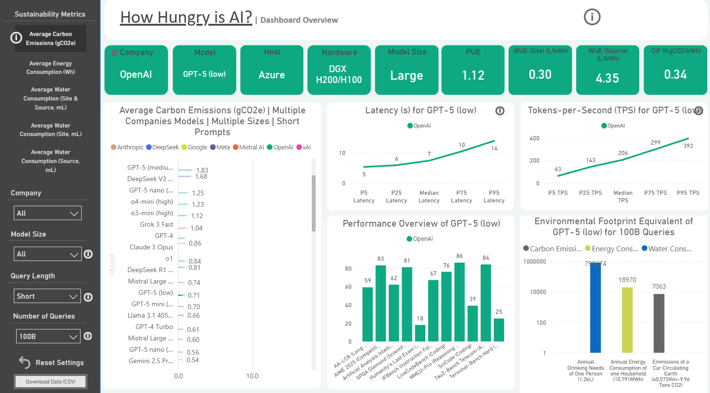
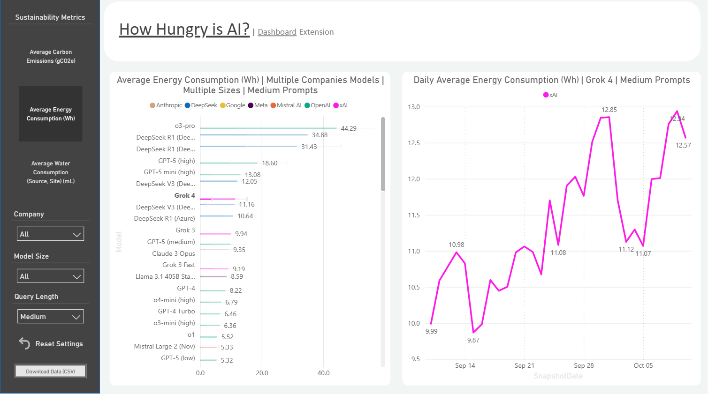
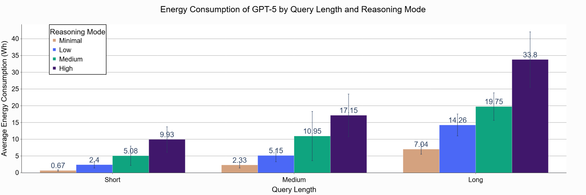
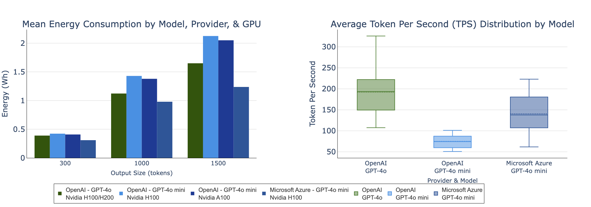

# How Hungry is AI? — Dashboard, Code, and Data (HowHungryisAIDashboard)

This repository powers the **“How Hungry is AI?”** dashboard and provides the **code + data release** accompanying our paper on *inference-phase* (operational) environmental footprints of LLMs.

The paper is constrained to **10 pages (excluding references)**, so this repo also hosts the **full tables, figures, and methodological details** that are too large for the manuscript.

- **Live Dashboard (Power BI):** https://app.powerbi.com/view?r=eyJrIjoiZjVmOTI0MmMtY2U2Mi00ZTE2LTk2MGYtY2ZjNDMzODZkMjlmIiwidCI6IjQyNmQyYThkLTljY2QtNDI1NS04OTNkLTA2ODZhMzJjMTY4ZCIsImMiOjF9  
- **GitHub Repository:** https://github.com/Nidhal-Jegham/HowHungryisAIDashboard

> **Scope note.** All estimates in this project focus on **operational inference** (electricity + associated water/carbon) using published infrastructure multipliers. We **do not** include training energy or embodied (Scope 3) impacts unless explicitly stated.

---

## What’s in this repo

### 1) Daily-updating data pipeline
An automated pipeline scrapes and aggregates model performance metrics (e.g., latency, throughput/TPS, and benchmark scores) and combines them with:
- **Hardware power specifications** (GPU + non-GPU),
- **Infrastructure multipliers** (PUE, WUE, CIF),
to estimate **per-query energy, water (site & source), and carbon**.

Outputs are exported as CSVs to `./output/` and used by the dashboard.

### 2) Supplementary materials (moved out of the 10-page paper)
To keep the manuscript within the page limit, the following items are hosted here instead of in the PDF:

- **Full per-model results table** (all models × prompt sizes): `./output/` (CSV exports)
- **Batch-size sensitivity analysis** (e.g., B=4/8/16 impacts on energy): recommended to keep as a repo figure/table (see “Figures” below)
- **Hardware inference detail for GPT‑4o mini** (OpenAI vs Azure): see figure below
- **GPT‑5 reasoning-mode energy comparison**: see figure below
- **Dashboard screenshots** (overview + time series): see figures below

If you are reading the paper and a section says “details in the repository,” this is where those extra materials live.

---

## Figures (supplementary visuals)

### Dashboard previews
**Main dashboard overview** (filters, footprint rankings, latency/TPS, and equivalence widgets):



**Time-series extension** (daily footprint tracking for selected models):



### GPT‑5 reasoning-mode energy (supplement)
This figure supports the discussion that routing/“reasoning mode” can change energy per prompt substantially:



### GPT‑4o mini hardware attribution (supplement)
This figure supports the inference that endpoints may run on different hardware classes (e.g., A100 vs H100/H200), affecting throughput and energy:



---

## Setup (local)

Install Python (**3.10–3.12 recommended**) and dependencies:

```bash
python -m venv .venv
source .venv/bin/activate
pip install -r requirements.txt
```

Run the cleaner/export step:

```bash
python Data_Cleaning_Final.py
```

> Depending on your configuration, you may need to run the scraper first (if CSV inputs are not already present). See workflow/scripts in this repo.

---

## Outputs

After running the pipeline, processed CSVs are written to:

- `./output/` — cleaned + aggregated exports used by the dashboard (and the paper’s full tables)

Use the dashboard’s **“Download Data (CSV)”** button for quick access to the latest release.

---

## Automation (GitHub Actions)

A GitHub Actions workflow is included to:
- run scraping + cleaning on a schedule,
- commit updated CSVs to `./output/`.

Enable workflows in the Actions tab and add any required secrets under:

**Settings → Secrets and variables → Actions**

(Secrets depend on your data-source configuration, e.g., credentials or API tokens.)

---

## How to cite

```bibtex
@article{jegham2025hungry,
  title={How hungry is ai? benchmarking energy, water, and carbon footprint of llm inference},
  author={Jegham, Nidhal and Abdelatti, Marwan and Koh, Chan Young and Elmoubarki, Lassad and Hendawi, Abdeltawab},
  journal={arXiv preprint arXiv:2505.09598},
  year={2025}
}
```
---

## Contact

For questions or issues, please open a GitHub Issue in this repository.
